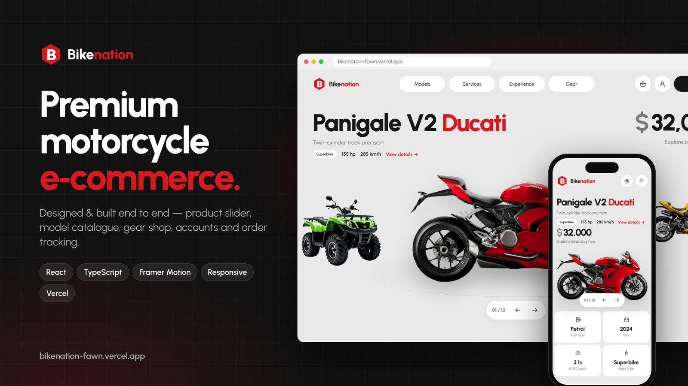
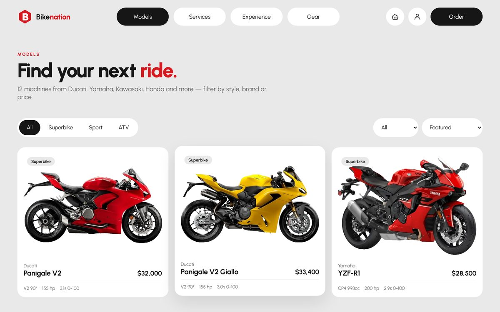
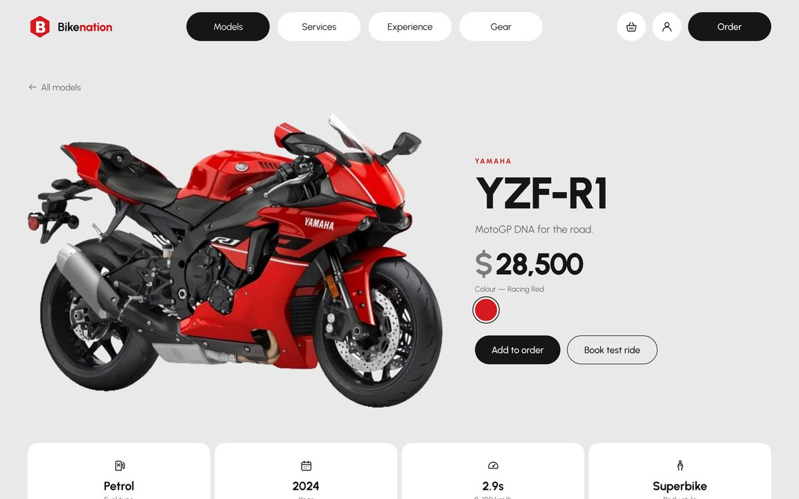
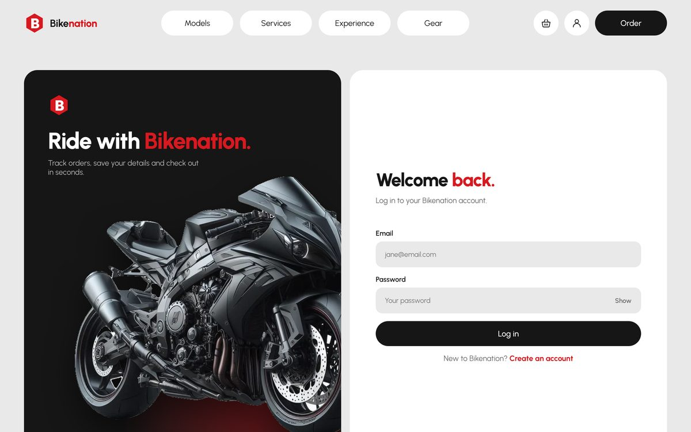
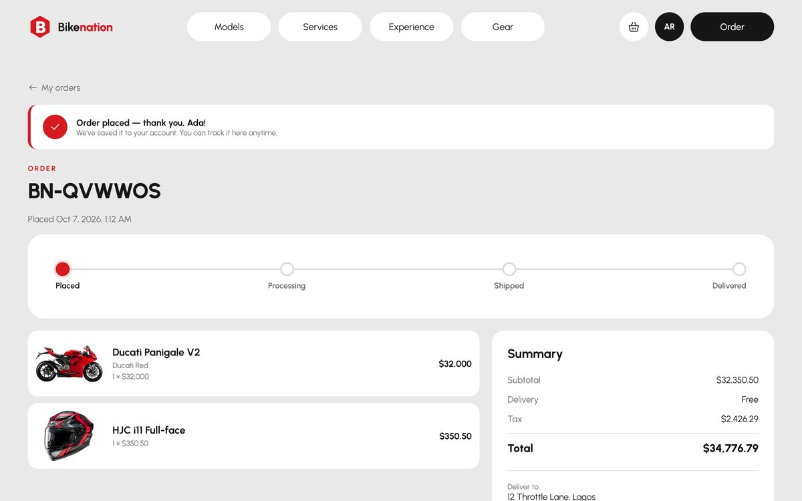
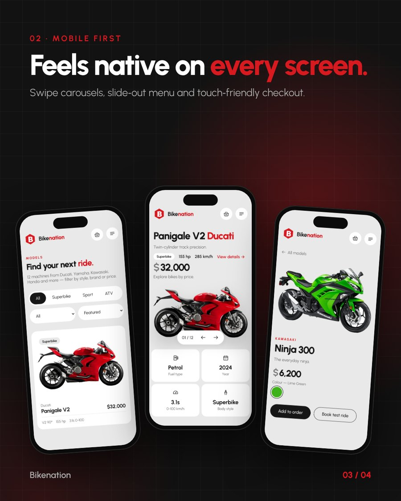

# Bikenation

**A premium motorcycle storefront — designed and built end to end.**

[**Live demo → bikenation-fawn.vercel.app**](https://bikenation-fawn.vercel.app)



Bikenation is a responsive e-commerce front end for a motorcycle dealership: a cinematic hero slider, a filterable model catalogue, a riding-gear shop, test-ride booking, and customer accounts with checkout and order tracking. Every page is built for desktop, tablet and mobile, with scroll-driven motion throughout.

## Features

- **Hero slider** — cycles through all 12 bikes with live name, price and spec tiles; arrows, drag/swipe, and a paint-colour picker that updates the price.
- **Scroll motion** — parallax hero, a pinned section that turns vertical scrolling into a horizontal bike lineup, scroll-in reveals, animated counters and a reading-progress bar.
- **Model catalogue** — filter by type and brand, sort by price, animated grid; a detail page per bike with colour options and full specs.
- **Gear shop & basket** — add helmets and bikes, change quantities, delivery and tax calculated live.
- **Accounts** — registration and login (with validation and show/hide password), profile editing, password change.
- **Checkout & order tracking** — prefilled delivery details, payment options, order confirmation and a Placed → Processing → Shipped → Delivered timeline in the customer's account.
- **Services & Experience pages** — service cards, an animated how-it-works timeline, ride events and a test-ride booking form.
- **Responsive** — a slide-out menu and swipeable carousels on phones, reflowed layouts on tablets.

## Screenshots

| Catalogue | Bike detail |
| --- | --- |
|  |  |
| **Login** | **Order tracking** |
|  |  |



## Tech stack

- [React 19](https://react.dev) + TypeScript, bundled with [Vite](https://vite.dev)
- [Framer Motion](https://motion.dev) for page transitions, layout animation and scroll-linked effects
- [React Router](https://reactrouter.com) for client-side routing
- Hand-written CSS with design tokens (no UI framework)
- Deployed on [Vercel](https://vercel.com)

## Run locally

```bash
npm install
npm run dev     # start the dev server
npm run build   # type-check and build to dist/
```

## Project structure

```
src/
  data.ts          bike and gear catalogue
  cart.tsx         basket state (persisted in the browser)
  auth.tsx         accounts, session and orders
  components/      header, footer, reveal-on-scroll, icons, shared UI
  pages/           Home, Models, ModelDetail, Services, Experience, Gear,
                   Order, Login, Register, Account, OrderDetail
public/images/     product photos (backgrounds removed, WebP)
```

## Notes

- **Concept project.** Not affiliated with Ducati, Yamaha, Kawasaki, Honda or HJC; brand names and product photos belong to their respective owners. Prices and specs are illustrative.
- **Demo accounts.** Accounts and orders are stored in the visitor's browser (passwords are salted and hashed, never stored in plain text). There is no server, and no real payments are taken. In a production build this layer would move to a backend such as Supabase.
